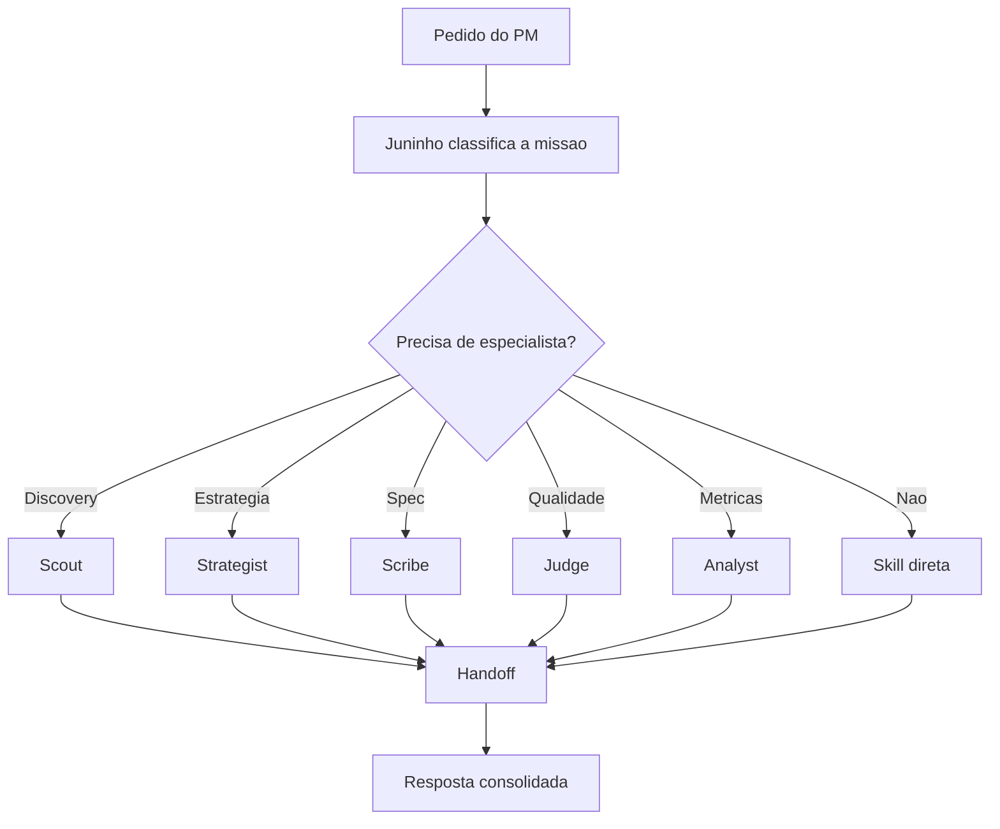

# Agent Flow

## Juninho

Juninho e o orquestrador. Ele escolhe o menor conjunto de skills necessario para a missao.



## Regra de ouro

Juninho nao deve transformar toda conversa em um processo pesado. A pergunta e sempre:

> Qual e o menor loadout que melhora a decisao agora?

## Handoff padrao

```json
{
  "agent": "specialist name",
  "mission": "what the agent evaluated",
  "skills_to_use": ["skill names"],
  "evidence": ["facts or sources used"],
  "analysis": ["main reasoning points"],
  "risks": ["uncertainties or trade-offs"],
  "recommendation": "clear recommendation",
  "next_action": "next concrete step"
}
```
